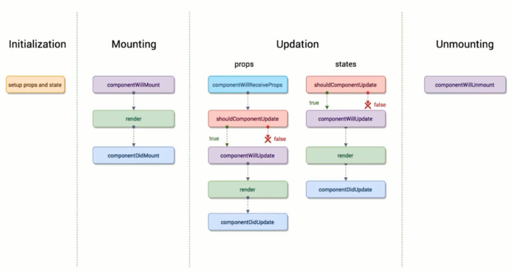

# React Learning（Day2）(2019.7.6)

>日常挤牙膏

## 一、拆分组件与组件之间的传值

- 1.父组件中加入子组件
```js
import Child from './Child'

return(
  <Child/>
)
```
- 2.父组件向子组件传数据
  - 父组件给子组件传递数据，通过标签属性传递，既可以传递数据，又可以传递方法，eg:    
  ```jsx
  <Child 
    content={item} //data
    index={index} //data
    deleteItem={this.handleItemDlete.bind(this)} //function
  />
  ```
  - 子组件接受父组件传递的数据，通过 `this.props.content`使用
  - 子组件接受父组件传递的函数，传值时要绑定父组件this，子组件再通过 `this.props.deleteItem(this.props.index);`调用

- 3.到达此步的源代码
  - Todolist.js
```js
import React, {Component,Fragment} from 'react'
import './style.css'
import TodoItem from './TodoItem'

class Todolist extends Component {

  constructor(props){
    super(props);
    this.state = {
      inputValue: '',
      list: []
    };
  }

  render() {
    return (
      <Fragment>
        <div>
          {/* 注释写法1 */}
          {
            // 注释写法2
          }
          <label htmlFor='insertArea'>输入内容：</label> 
          {/* 注意for用htmlFor代替 */}
          <input
            id='insertArea'
            className='input' // 注意class用className代替
            value={this.state.inputValue}
            onChange={this.handleInputChange.bind(this)} //函数的this绑定组件对象的this
          />
          <button onClick={this.handleBtnClick.bind(this)}>提交</button>
        </div>
        <ul>
          {
            this.state.list.map((item,index) => {
              return (
                <div>
                  <TodoItem 
                    content={item} 
                    index={index}
                    deleteItem={this.handleItemDlete.bind(this)} // this绑定到父组件
                  />
                  {/* <li 
                    key={index} 
                    onClick={this.handleItemDlete.bind(this,index)}
                    dangerouslySetInnerHTML={{__html: item}}
                  >
                  </li> */}
                </div>
                
              ) 
            })
          }
        </ul>
      </Fragment>
    );
  }

  handleInputChange(e){
    // console.log(this);
    this.setState({
      inputValue: e.target.value
    });
  }

  handleBtnClick(){
    this.setState({
      list: [...this.state.list,this.state.inputValue],
      inputValue: ''
    });
  }

  handleItemDlete(index){
    // immutable
    // state 不允许我们做任何更改，可以修改副本
    const list = [...this.state.list];
    list.splice(index,1);
    this.setState({
      list:list
    })
  }

}

export default Todolist;
```
  - TodoItem.js
```js
import React, { Component } from 'react'

class TodoItem extends Component {

  constructor(props) {
    super(props);
    this.handleClick=this.handleClick.bind(this);
  }

  render() {
    return (
      <li
        onClick={this.handleClick}
        //key={this.props.index}
      >
        {this.props.content}
      </li>
    )
  }

  handleClick() {
    this.props.deleteItem(this.props.index);
    //alert(this.props.index);
  }
}

export default TodoItem
```

## 二、代码优化

优化后代码如下：
- Todolist.js
```js
import React, {Component,Fragment} from 'react'
import TodoItem from './TodoItem'
import './style.css'

class Todolist extends Component {

  constructor(props){
    super(props);
    this.state = {
      inputValue: '',
      list: []
    };
    this.handleInputChange=this.handleInputChange.bind(this);
    this.handleBtnClick=this.handleBtnClick.bind(this);
    this.handleItemDlete=this.handleItemDlete.bind(this);
  }

  render() {
    return (
      <Fragment>
        <div>
          <label htmlFor='insertArea'>输入内容：</label> {/* 注意for用htmlFor代替 */}
          <input
            id='insertArea'
            className='input' // 注意class用className代替
            value={this.state.inputValue}
            onChange={this.handleInputChange} //函数的this绑定组件对象的this
          />
          <button onClick={this.handleBtnClick}>提交</button>
        </div>
        <ul>
          {this.getTodoItem()}
        </ul>
      </Fragment>
    );
  }

  getTodoItem(){
    return this.state.list.map((item,index) => {
      return (
        <TodoItem 
          key={index}
          content={item} 
          index={index}
          deleteItem={this.handleItemDlete} // this绑定到父组件
        />
      ) 
    })
  }

  handleInputChange(e){
    // console.log(this);
    // 旧版
    /* this.setState({
      inputValue: e.target.value
    }); */
    //新版，对象变函数，异步，将e.target.value存在外层
    const value = e.target.value;
    this.setState(() => ({
        inputValue: value
    }))
  }

  handleBtnClick(){
    /*this.setState({
      list: [...this.state.list,this.state.inputValue],
      inputValue: ''
    });*/
    this.setState((prevState) => ({
      list: [...prevState.list,prevState.inputValue],
      inputValue: ''
    }))

  }

  handleItemDlete(index){
    /*
    const list = [...this.state.list];
    list.splice(index,1);
    this.setState({
      list:list
    })
    */
    this.setState((prevState)=>{
      const list = [...prevState.list];
      list.splice(index,1);
      return{list}
    })
  }

}

export default Todolist;
```
- TodoItem.js
```js
import React, { Component } from 'react'

class TodoItem extends Component {

  constructor(props) {
    super(props);
    this.handleClick=this.handleClick.bind(this);
  }

  render() {
    const {content} = this.props;
    return (
      <div
        onClick={this.handleClick}
        //key={this.props.index}
      >
        {content}
      </div>
    )
  }

  handleClick() {
    const {deleteItem,index} = this.props;
    deleteItem(index);
    //alert(this.props.index);
  }
}

export default TodoItem
```

## 三、React开发一些概念

### 1、声明式开发
（与其对应的是命令式开发，直接操作dom）

我们只是操作数据，React自己操作dom。React是数据驱动的框架，数据变化，页面自动变化。可以减少DOM操作量

### 2、可以与其他框架并存
只负责自己组件挂载的节点

### 3、组件化
页面由一个个小组件构成

### 4、单向数据流
父组件可以向子组件传递数据，但子组件只读不能修改；

子组件可以使用父组件方法改数据。

### 5、视图层框架
React修改数据可能会很复杂，所以只负责页面，其他工作由其他框架flux，redux等完成

### 6、函数式编程
使其容易实现前端函数化测试

## 四、React开发插件安装

1.科学上网，用Chrome浏览器安装React Developer Tools插件

2.打开页面，该插件灰色表示没用react开发，红色表示处于react开发阶段，黑色表示react编写已在线上状态。

## 五、传递参数的校验和默认值

### propTypes
```js
import PropTypes from 'prop-types'

TodoItem.propTypes = {
  test: PropTypes.string.isRequired, //要求一定检验
  comtent: PropTypes.string,
  deleteItem: PropTypes.func,
  index: PropTypes.number
}
```
### defaultProps
```js
TodoItem.defaultProps = {
  test: 'hello world'
}
```

参考官网地址：https://reactjs.org/docs/typechecking-with-proptypes.html

## 六、Props，State 与 render 函数

当组件的state或者props发生改变时，render函数就会重新执行

父组件的render函数被运行时，他的子组件的render都会被重新运行一次

## 七、什么是虚拟DOM

**第一种：**
1. state 数据
2. jsx 模板
3. 数据 + 模板 结合，生成真实的DOM，来显示
4. state 发生改变
5. 数据 + 模板 结合，生成真实的DOM，替换原始的DOM

**缺陷：**

第一次生成了一个完整的DOM片段   
第二次生成了一个完整的DOM片段   
第二次的DOM替换第一次的DOM，非常耗性能

**改良：**
1. state 数据
2. jsx 模板
3. 数据 + 模板 结合，生成真实的DOM，来显示
4. state 发生改变
5. 数据 + 模板 结合，生成真实的DOM，并不直接替换原始的DOM
6. 对比新（DocumentFragment）旧DOM，找差异
7. 找出input框发生变化
8. 只用新的DOM中的input元素，替换老的DOM中的input元素

**缺陷：**

性能提升不明显

**再改良：**
1. state 数据
2. JSX模版
3. 数据+模版结合，生成虚拟DOM (虚拟DOM就是一个JS对象，用它来描述真实DOM) (损耗了性能)
  ```js
  ['div', {id: 'abc'}, ['span', {}, 'hello world']]
  ```
4. 用虚拟DOM的结构，生成真实的DOM,来显示
  ```html
  <div id='abc'><span>hello world</span></div>
  ```
5. state 发生变化
6. 数据 + 模板 生成新的虚拟DOM （极大地提升性能）
  ```js
  ['div', {id: 'abc'}, ['span', {}, 'bye bye']]
  ```
7. 比较原始虚拟DOM和新的虚拟DOM的区别，找到区别是span中内容 （极大地提升性能）
8. 直接操作DOM, 改变span中的内容

**优点：**
1. 性能提升了
2. 它使得跨端应用得以实现。React Native
    - 虚拟DOM -> 真实DOM -> 网页
    - 虚拟DOM -> 原生应用组件 -> 原生应用

## 八、深入理解虚拟DOM

>JSX -> JS对象 -> 真实的DOM

JSX -> JS对象实现原理

```js
return <div>item</div>
```
<=>
```js
return React.createElement('div',{},item)
```

即：JSX -> createElement -> JS对象

## 九、虚拟DOM中的Diff算法

1. 同层虚拟DOM比对，由上到下，一层变化，该层下面不再比对，该层及以下全部重新渲染

2. 给节点绑定key值的原因：建立正确关系，方便对比。

3. 给节点绑定key值不用index的原因：index会变化，失去key的价值，但可以用value作为key值。注意用稳定的参数作为key值才是正确的做法。eg：
```jsx
<TodoItem 
  key={item}
/>
```

## 十、React中ref的使用

1. ref帮助我们在react中直接获取DOM元素，最好少用
2. eg：
```js

  <ul ref={(ul)=>{this.ul = ul}}>
    {this.getTodoItem()}
  </ul>

  handleBtnClick(){
    this.setState((prevState) => ({
      list: [...prevState.list,prevState.inputValue],
      inputValue: ''
    }),()=>{
      console.log(this.ul.querySelectorAll('div').length);
    })
  }

```

## 十一、React中的生命周期函数

1. 生命周期函数指在某一时刻组件会自动调用执行的函数。

2. eg：
  - render() // state、props变化时自动调用
  - constructor() // 组件创建时调用

3. 一些说明


```js
//1.初始化阶段
constructor(){}

//2.挂载阶段
componentWillMount(){} //①在组件即将被挂载到页面的时刻自动执行
render(){} //②挂载页面时执行
componentDidMount(){} //③组件被挂载到页面之后，自动被执行

//3.更新流程
//（1）props发生变化

//一个组件要从父组件接受参娄文
//只要父组件的render函数被重新执行了，子组件的这个生命周期函数就会被执行
componentWillReceiveProps(){} 
shouldComponentUpdate(){return true;//false不更新组件，结束} //组件更新前自动执行
componentWillUpdate(){} //组件更新前shouldComponentUpdate返回true自动执行,返回false不执行
render(){}
componentDidUpdate(){} //组件更新后自动执行

//（2）states发生变化
shouldComponentUpdate(){return true;//false不更新组件，结束} //组件更新前自动执行
componentWillUpdate(){} //组件更新前shouldComponentUpdate返回true自动执行,返回false不执行
render(){}
componentDidUpdate(){} //组件更新后自动执行

//4.卸载阶段
//当这个组件即将被从页面中剔除的时候，会被执行
componentWillUnmount(){}
```

## 十二、生命周期函数应用场景

1. `shouldComponentUpdate`可以避免子组件在父组件更新时重复渲染，实现性能优化，子组件添加如下代码
```js
shouldComponentUpdate (nextProps, nextState) {
  if ( nextProps . content !== this. props. content) {
    return true ;
  }else {
    return false;
  }
}
```

2. `ajax`请求放在`componentDidMount`函数里

  - 安装`axios`
```bash
yarn add axios #或者 npm install axios -S
```
  - 引入`axios`和发送请求
```js
import axios from 'axios'

componentDidMount() {
  axios.get('/api/todolist')
    .then(()=>{alert('succ')})
    .catch(()=>{alert('error')})
}
```

## 十三、使用`Charles`进行接口数据模拟

### 1.install Charles Software
- 官网下载安装包安装：https://www.charlesproxy.com
- 破解教程：https://www.cnblogs.com/rrl92/p/7928770.html
- 破解工具：https://www.zzzmode.com/mytools/charles/

### 2.use Charles
Tools>Map local>
```
Map From
Protocol:http
Host:localhost
Port:3000
Path:api/todolist

Map to
Local path:C:\Users\Administrator\Desktop\todolist.json
```
todolist.json如下
```json
["Dell","Lee","IMOOC"]
```
<question>**不知道为什么Chrome老是获取不到那个json文件，但是QQbrowser却可以。？？？**</question>

## 十四、引入css样式

部分css代码
```css
.show{
    opacity: 1;
    transition: all 1s ease-in;
}
.hide{
    opacity: 0;
    transition: all 1s ease-in;
}
```
部分js代码
```js
import './style.css'

  constructor(props){
    super(props);
    this.state = {
      show:true
    };
    this.handleToggle=this.handleToggle.bind(this);
  }

  render() {
    return (
      <div className={this.state.show?'show':'hide'}>hello</div>
      <button onClick={this.handleToggle}>CSStoggle</button><br/>
    )
  }

  handleToggle(){
    this.setState({
      show: this.state.show?false:true
    })
  }
```
