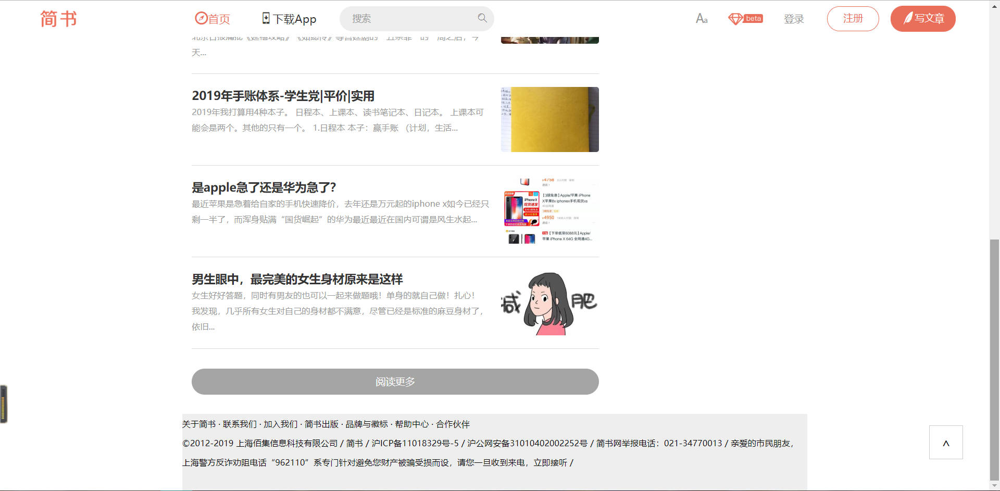
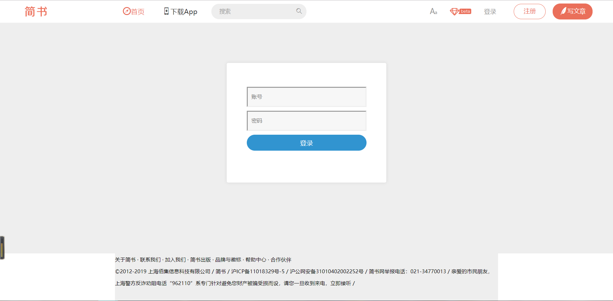

# React Learning（Day3-）(2019.7.7-)

>日常挤牙膏

>React项目实战：[简书](https://www.jianshu.com/) 官网

## 一、项目结构
```
│  .gitignore
│  package-lock.json
│  package.json
│  README.md
│
├─public
│  │  faviconjianshu.ico
│  │  index.html
│  │
│  └─api
│          detail.json
│          headerList.json
│          homeData.json
│          homeList.json
│          login.json
│
└─src
    │  App.js
    │  index.js
    │  style.js
    │
    ├─common
    │  ├─footer
    │  │      index.js
    │  │      style.js
    │  │
    │  └─header
    │      │  index.js
    │      │  style.js
    │      │
    │      └─store
    │              actionCreators.js
    │              constants.js
    │              index.js
    │              reducer.js
    │
    ├─pages
    │  ├─detail
    │  │  │  index.js
    │  │  │  loadable.js
    │  │  │  style.js
    │  │  │
    │  │  └─store
    │  │          actionCreators.js
    │  │          constants.js
    │  │          index.js
    │  │          reducer.js
    │  │
    │  ├─home
    │  │  │  index.js
    │  │  │  style.js
    │  │  │
    │  │  ├─components
    │  │  │      DownloadApp.js
    │  │  │      List.js
    │  │  │      Recommend.js
    │  │  │      Topic.js
    │  │  │      Writer.js
    │  │  │
    │  │  └─store
    │  │          actionCreators.js
    │  │          constants.js
    │  │          index.js
    │  │          reducer.js
    │  │
    │  ├─login
    │  │  │  index.js
    │  │  │  style.js
    │  │  │
    │  │  └─store
    │  │          actionCreators.js
    │  │          constants.js
    │  │          index.js
    │  │          reducer.js
    │  │
    │  └─write
    │          index.js
    │
    ├─statics
    │  │  beta.png
    │  │  logo.png
    │  │
    │  └─iconfont
    │          iconfont.eot
    │          iconfont.js
    │          iconfont.svg
    │          iconfont.ttf
    │          iconfont.woff
    │
    └─store
            index.js
            reducer.js
```
## 二、各部分功能简介

### 1.common（公共部分）
- [x] header
    - [x] logo //简书图标
    - [x] icofont //指南针、手机、放大镜、毛笔、刷新 图标
    - [x] search box with variable length //聚焦变长搜索框
    - [x] '换一批' //换一批逻辑和动画，从API获取热门搜索
    - [x] login //登录按钮
    - [x] logout //登出按钮
    - [ ] singup //注册按钮
    - [x] Write Artical //写文章按钮
- [x] footer //底部

### 2.pages（具体页面）
- [x] home page //主页，从API获取热门话题、文章列表
- [x] detail page //详情页面，从API获取文章
- [x] login page //登录页面，账号密码随意，从API验证
- [ ] write page //写作业面，含未登陆不允许访问设置

### 3.总体框架

public文件夹下的`index.html`是文件入口

public文件夹下的`api`是存放接口数据

src下的`index.js`给上面的文件indext.html注入<App/>大组件

src下的`style.js`给文件App.js注入总体样式

src下的`App.js`汇集所有子组件、数据store

src下的`statics`目录下存放静态文件

src下的`store`目录下存数据

src下的`common`目录下存`header`&`footer`组件

src下的`pages`目录下存`detail`,`home`,`login`,`write`组件

### 4.某一组件（detail）说明

`index.js`总体文件

`style.js`样式文件

`loadable.js`懒加载文件

`store`发请求文件夹

store下的`index.js`发请求接口文件

store下的`reducer.js`处理请求

store下的`actionCreators.js`派发请求

store下的`constants.js`存常量

## 三、运行截图


### Footer & More



### Detail


### Login



## 四、代码仓库

仓库地址：https://github.com/Allenem/ReactDraft/tree/master/jianshu

快速开始：

```bash
git clone https://github.com/Allenem/ReactDraft.git

cd jianshu

npm install

npm run start
```
